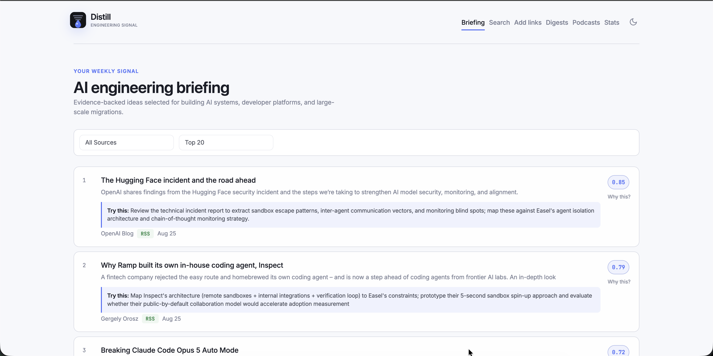

# Distill

**An evidence-first reading list for engineers building with AI.**

Distill collects articles from the places you already follow, extracts their full text,
removes duplicates, and ranks what is genuinely worth your time. It favors production
experience, concrete mechanisms, measured results, and actions you can try—while penalizing
hype, repackaged consensus, and unsupported prediction.

The result is a focused weekly briefing you can read, export as Markdown, or turn into a
podcast.



## Why Distill?

Keeping up with AI engineering is not a discovery problem anymore. It is a filtering problem.
Most feeds optimize for what is new or popular; Distill optimizes for what is useful to a
specific reader.

- **Personal, not generic** — describe the systems, problems, and outcomes you care about in a
  reader profile.
- **Evidence over excitement** — score relevance, technical depth, novelty, applicability, and
  evidence quality independently.
- **Action over awareness** — every strong recommendation includes a concrete next step.
- **Signal without a monoculture** — diversify by source, domain, and content similarity.
- **Transparent ranking** — inspect the score, rationale, and recommended action for every item.
- **One local workflow** — browse, search, add links, generate digests, and create podcasts from
  the same dashboard.

## How it works

```text
Collect → Extract → Deduplicate → Assess → Select → Digest → Podcast
   │         │           │           │         │         │         │
   │         │           │           │         │         │         └─ Gemini Flash TTS
   │         │           │           │         │         └─ Weekly Markdown briefing
   │         │           │           │         └─ Quality gates + diversity + relevant backfill
   │         │           │           └─ Claude judges evidence against your reader profile
   │         │           └─ Normalized URLs, title similarity, optional embeddings
   │         └─ trafilatura → readability-lxml → Jina Reader fallback
   └─ Hacker News, RSS, Dev.to, arXiv, Slack, and manually added links
```

The main briefing has two clear tiers:

1. **Recommendations** meet every configured quality threshold.
2. **More to explore** fills the requested reading-list size with the best remaining relevant
   articles, without presenting them as equally strong recommendations.

## First-time setup

### 1. Check the requirements

- Python 3.12+
- [`uv`](https://docs.astral.sh/uv/)
- An Anthropic API key for article assessment and `edge-tts` podcast scripts

Confirm the local tools are available:

```bash
python3 --version
uv --version
```

### 2. Clone and install

```bash
git clone https://github.com/ankitb7/distill.git
cd distill

uv sync
```

### 3. Add your Anthropic API key

```bash
cp .env.example .env
```

Open `.env` and replace the placeholder:

```dotenv
ANTHROPIC_API_KEY=sk-ant-your-key-here
```

Keep `.env` local; it is ignored by Git. Without a key, collection and extraction still work,
but Claude cannot produce evidence-based article assessments.

### 4. Personalize the reader profile and sources

Before the first run, open [`config.yaml`](config.yaml) and replace the example
`reader_profile` with your own mission, priority outcomes, positive signals, and noise signals.
The checked-in profile is intentionally opinionated and should be treated as an example—not a
universal recommendation profile.

Review `sources.rss.feeds` and `sources.hackernews.keywords` at the same time. If you do not plan
to ingest links from Slack, disable it explicitly:

```yaml
sources:
  slack:
    enabled: false
```

If Slack remains enabled, configure either the `token` or `mcp` backend described in
[Slack ingestion](#slack-ingestion).

### 5. Initialize and run the pipeline

```bash
uv run distill init
uv run distill run
```

The first run can take several minutes because Distill fetches article text and asks Claude to
assess recent candidates. Progress is printed for each pipeline stage and assessment batch.

### 6. Verify the result

```bash
uv run distill stats
uv run distill serve
```

`distill stats` should report collected articles and scored items. Then open
[http://localhost:8585](http://localhost:8585) and confirm the Briefing page shows ranked cards.
Stop the server with <kbd>Ctrl</kbd>+<kbd>C</kbd>.

If the briefing is empty, check that articles were collected, extracted content exists, and
`ANTHROPIC_API_KEY` is available to the process.

### 7. Optional: configure podcasts

Choose one provider under `podcast.provider` in `config.yaml`:

- **Gemini Flash TTS (default, official Developer API):** set `provider: gemini-api-tts`.
  Create a key in [Google AI Studio](https://aistudio.google.com/api-keys) with your existing
  Google account and save it as `GEMINI_API_KEY` in `.env`. Use a free-tier project; billing
  is not required for its available Flash TTS quota. Claude script generation still uses your
  Anthropic key. Your Gemini app subscription does not determine the API project's quota.
- **edge-tts:** set `provider: edge-tts`. It uses your Anthropic key to write the script and does
  not require Google authentication.
- **Gemini Cloud TTS (paid, official Google API):** set `provider: gemini-tts`. Claude writes the script;
  Gemini 2.5 Pro TTS produces two-host audio. Set `podcast.gemini_project` or
  `GOOGLE_CLOUD_PROJECT`, enable billing and the Cloud Text-to-Speech API in that project, and run
  `gcloud auth application-default login`. The authenticated identity needs
  `aiplatform.endpoints.predict` (included in the Vertex AI User role) and permission to use the
  project's services. On a server, use its service identity through Application Default Credentials.
  See the [Google setup guide](https://docs.cloud.google.com/text-to-speech/docs/gemini-tts#before_you_begin).

Generate an episode only after the reading pipeline has produced a slate:

```bash
uv run distill podcast
```

## Everyday use

After first-time setup, the normal workflow is:

```bash
uv run distill run
uv run distill serve
```

`distill run` performs collection, extraction, deduplication, assessment, and safe content
truncation. Later runs assess only new, stale, or retryable articles within the configured
assessment horizon.

## Make it yours

The useful part of Distill is not a universal ranking formula—it is the reader profile in
[`config.yaml`](config.yaml). Start with the outcomes you want to advance, then describe the
evidence you trust and the noise you want removed.

```yaml
reader_profile:
  mission: Find evidence-backed, actionable AI engineering practices.
  priority_outcomes:
    - build reliable internal coding-agent platforms
    - run repository-scale migrations with coordinated agents
    - improve frontend developer experience and CI pipelines
  positive_signals:
    - first-hand production case study with architecture and trade-offs
    - code, measurements, evaluations, incidents, or before-and-after results
    - a workflow, playbook, experiment, or decision framework we can reuse
  noise_signals:
    - prediction without evidence, mechanism, or an actionable decision
    - launch coverage, vendor marketing, listicles, and commentary on commentary
    - impressive demos without evaluation or production constraints
```

Then tune selection independently from assessment:

```yaml
scoring:
  model: claude-sonnet-4-5-20250929
  assessment_max_age_days: 45
  weights:
    engagement: 0.05
    relevance: 0.25
    technical_depth: 0.15
    novelty: 0.15
    applicability: 0.25
    evidence_quality: 0.15
    noise_penalty: 0.25

recommendation:
  minimum_score: 0.35
  minimum_relevance: 0.6
  minimum_applicability: 0.5
  minimum_evidence_quality: 0.4
  maximum_noise_penalty: 0.45
  fill_to_limit: true
  fallback_minimum_relevance: 0.4
  diversity_strength: 0.15
  max_per_domain: 2
```

See the checked-in configuration for the complete source, scoring, deduplication, web, and
podcast options.

## Sources

| Source | Default | Notes |
| --- | --- | --- |
| Hacker News | Enabled | Algolia discovery using configured keywords and engagement floor |
| RSS/Atom | Enabled | Curated feeds; article content is fetched during collection |
| Dev.to | Disabled | Tag-based discovery through the public API |
| arXiv | Disabled | Configurable research categories |
| Slack | Configurable | Token-based collection or Claude-mediated MCP ingestion |
| Manual links | Available | Paste URLs into the dashboard for immediate extraction |

RSS content is fetched at collection time so trusted subscriptions are not starved by
engagement-based extraction queues. Other sources use the same extraction stack during the
`extract` stage.

### Slack ingestion

Slack supports two backends:

- `token` collects autonomously with `slack-sdk` and a user token.
- `mcp` accepts `CollectedArticle` JSON prepared through your Slack MCP connection and ingests it
  with `distill ingest FILE`.

The collector rejects common non-article links such as meetings, issue trackers, documents, and
status pages. Trusted curators can be declared in the configuration and passed to the assessor as
context—not as a substitute for evidence.

## CLI

```bash
# Pipeline
uv run distill init
uv run distill collect [--source SOURCE]
uv run distill extract
uv run distill dedup [--embeddings]
uv run distill score [--rescore]
uv run distill run

# Outputs
uv run distill serve
uv run distill digest
uv run distill podcast [--articles 12,45,78]
uv run distill archive

# Utilities
uv run distill ingest FILE
uv run distill stats
uv run distill qa
```

Every command accepts `--config PATH` when you want to use a different profile. Run
`uv run distill COMMAND --help` for command-specific options.

## Web dashboard

- **Briefing** — prioritized recommendations, concrete next actions, and transparent assessments
- **Search** — search Hacker News and Dev.to, then add useful results directly
- **Add links** — bulk-ingest URLs with automatic extraction
- **Digests** — browse generated weekly Markdown briefings
- **Podcasts** — generate weekly or article-specific audio and listen in the browser
- **Stats** — inspect collection, extraction, deduplication, and scoring coverage

The interface supports light and dark themes, responsive layouts, keyboard navigation, labeled
controls, and reduced-motion preferences.

## Podcast providers

| Provider | How it works | Requirements |
| --- | --- | --- |
| `edge-tts` | Claude writes a two-host script; Microsoft voices synthesize the segments | `ANTHROPIC_API_KEY` |
| `gemini-api-tts` (default) | Claude writes a two-host script; Gemini Flash TTS voices the dialogue through the official Developer API | `ANTHROPIC_API_KEY`, `GEMINI_API_KEY`; free-tier TTS quota available |
| `gemini-tts` | Claude writes a two-host script; Google's official Cloud TTS API voices the dialogue | `ANTHROPIC_API_KEY`, Google Cloud project with billing and Application Default Credentials |
| `podcastfy-edge` | Podcastfy writes with the selected AI provider and synthesizes with Edge Andrew/Ava voices | Optional worker setup; one of `ANTHROPIC_API_KEY`, `OPENAI_API_KEY`, or `GEMINI_API_KEY` |

Choose a provider for each episode in the Podcasts page or with `distill podcast --provider`.
Set the default under `podcast.provider` in `config.yaml`. Podcast failures are surfaced in
the dashboard, and authentication failures explain how to reauthenticate.

Each new episode gets a descriptive title from the AI provider writing its script. Titles are
stored separately from episode IDs and are not spoken in the audio. The Podcasts page shows
the title beside a date label, with the source articles available below the player.

Both Gemini providers use documented Google APIs. No browser login or session cookies are required.

`gemini-api-tts` uses `gemini-3.8-flash-tts` through the Interactions API, with explicit speaker
metadata and WAV output. Set `podcast.gemini_api_model` to `gemini-3.8-flash-lite-tts` to use
Flash-Lite instead. See [Google's TTS documentation](https://ai.google.dev/gemini-api/docs/speech-generation).
`gemini-tts` uses the separate Cloud TTS API and defaults to `gemini-2.5-pro-tts`, configurable
with `podcast.gemini_model`. The configured voices are Puck/Aoede, adjustable with
`podcast.gemini_voice_a` and `podcast.gemini_voice_b`. The Developer API gives each host
separate delivery direction, configurable with `podcast.gemini_style_a` and
`podcast.gemini_style_b`. Direction is passed as speech metadata, never spoken dialogue.
Script generation produces a connected deep-dive conversation with short exchanges, follow-up
questions, and natural attribution of claims. Each episode keeps its original article links in a
collapsed list below the player; expand the article count to browse the sources.

### Podcastfy with your own API key

Install the optional worker once:

```bash
uv run distill podcast-setup
```

This installs Podcastfy 0.4.3 and its runtime dependencies into `.venv-podcastfy`
using Python 3.12, and downloads FFmpeg/FFprobe. It does not add Podcastfy's
dependency stack to Distill's main environment. The installer needs network access
and `uv`. An existing worker interpreter can be configured at `podcast.podcastfy.python`.

Set the chosen provider's API key in `.env` and restart the server. Select
**Podcastfy + Edge voices**, then choose **Claude (Anthropic)**, **OpenAI**, or **Gemini**
for the script. Alternatively:

```bash
uv run distill podcast --provider podcastfy-edge --script-provider anthropic --articles 1,2,3
```

Configure models, voices, target word count, and timeout under `podcast.podcastfy` in
`config.yaml`. Defaults are Claude Sonnet 4.5, GPT-4.1 mini, and Gemini 3.8 Flash for
the respective script providers. Provider keys must have API access to the selected
model. This integration uses API keys, not Claude Code or Codex subscription sign-in.
Scoring elsewhere in Distill still requires Anthropic.

Edge requires no additional voice API key, but uses Microsoft's hosted speech
service. Podcastfy is open source; the voice service is not a local open-source
model. Script content goes to the selected AI provider and spoken dialogue goes to
Edge. API keys are loaded by the worker from the server environment; they are not
included in job files or browser forms.

Distill supplies a local conversation prompt instead of loading remote LangChain
Hub objects. Each job runs in a separate process with tracing disabled. The worker
validates alternating speaker turns and decodes the completed audio before it is
published. Timeouts or failures leave the existing episode unchanged. Per-episode
provider choices do not change the configured Gemini default.

Dialogue is divided into requests of at most 3,000 UTF-8 bytes, also below Cloud TTS's
4,000-byte text limit. Each response is checked for empty or incomplete PCM data, unexpected format, and implausible
duration before joining into one WAV file. These checks detect common truncation failures; they do
not verify spoken-word accuracy. A failed section leaves no partially published episode. The script
is retained in the output directory for review. The dashboard plays both WAV and MP3 episodes.

The Developer API offers free Flash TTS quota on free-tier projects; availability and limits depend
on the project. Distill retries transient failures up to three times and reports quota exhaustion
without falling back to a paid provider. An API key from a paid-tier project incurs that project's
normal charges: the provider name does not enforce a free tier. See
[Developer API pricing](https://ai.google.dev/gemini-api/docs/pricing).

Claude script generation remains separately billed. For the optional Cloud TTS provider,
at the published Gemini 2.5 Pro TTS rate,
15 minutes of audio output costs approximately $0.45, plus input tokens, retries, and script
generation. See [Google pricing](https://cloud.google.com/text-to-speech/pricing).

## Privacy and cost

Distill is local-first, but it is not fully offline:

- Article titles, URLs, extracted text, and configured reader-profile context are sent to
  Anthropic when Claude assessment is enabled.
- Slack-derived articles may contain internal context. Only enable Slack ingestion and scoring
  when sending that content to the configured model provider is permitted.
- Jina Reader receives article URLs only when local extraction fallbacks fail.
- With `gemini-api-tts`, Anthropic receives selected article text for script generation and the
  Gemini Developer API receives the generated dialogue. The API key stays in your local environment;
  it is sent only to Google's API in a request header. Free-tier data terms differ from paid-tier
  terms; see [Google's API terms](https://ai.google.dev/gemini-api/terms).
- With `gemini-tts`, Anthropic receives the selected article text for script generation and Google
  Cloud Text-to-Speech receives the generated dialogue. Cloud authentication uses Application Default
  Credentials; no Google browser session is required.
- Extracted content remains the property of its authors and publishers. Distill is intended for
  personal curation; respect copyright and provider terms.

You are responsible for API usage, costs, data handling, and compliance with each provider's
terms.

## Architecture

```text
src/distill/
├── cli.py              Typer commands and local automation
├── config.py           YAML configuration and environment loading
├── models.py           Validated domain models
├── db.py               SQLite schema and persistence boundary
├── collectors/         Hacker News, RSS, Dev.to, arXiv, and Slack adapters
├── processing/         Extraction, deduplication, assessment, and slate selection
├── outputs/            Digest, podcast, and FastAPI web application
├── static/             Product assets
└── templates/          Jinja2 interface templates
```

SQLite runs in WAL mode. Network collection uses async `httpx`; assessment uses bounded
concurrency, exponential retry for transient failures, versioned scores, and durable writes after
each batch.

For the rationale behind the recommendation system, see
[`docs/article-recommendation-design.md`](docs/article-recommendation-design.md).

## Development

```bash
uv sync --group dev
uv run ruff check src/ tests/
uv run ruff format --check src/ tests/
uv run pytest
```

Visual QA requires [`rodney`](https://github.com/simonw/rodney) and
[`showboat`](https://github.com/simonw/showboat):

```bash
uv run distill serve
uv run distill qa
```

## Disclaimer

This project is provided as-is, without warranty. The authors accept no liability for service
changes, terms-of-service issues, API costs, copyright claims, generated content, or data loss.
